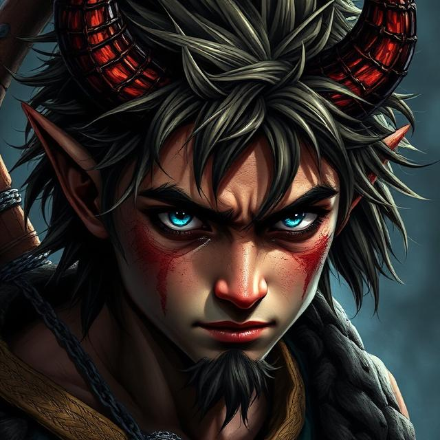
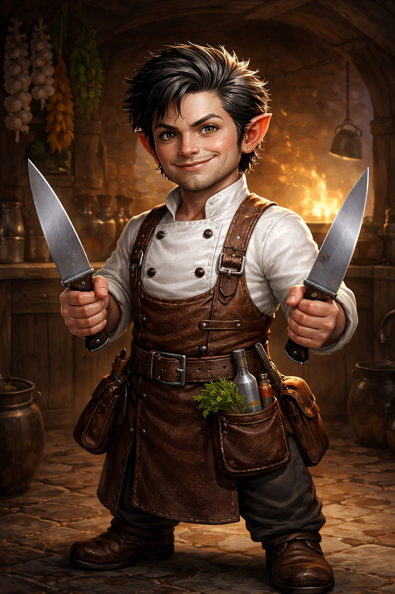
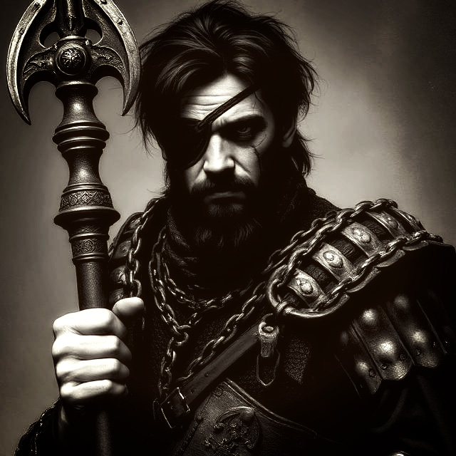
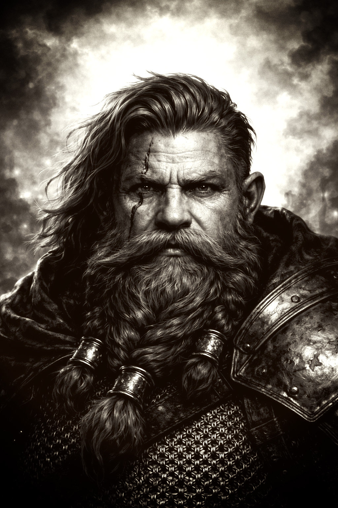

# Neverwinter

A D&D 5e campaign set in the Sword Coast.

This repository serves as a shared reference for session notes.  
Players can review sessions at their leisure, and the Party Roster will update as characters come and go.

The _Chronicle_ below records each session in a ..mostly consistent format.

⚠️ Player-facing notes only.  
DM secrets are stored separately.

---

## Current Arc
Exploring the mysteries in and around [Phandalin](https://github.com/Svalbaz/Neverwinter/blob/main/locations/README.md#-phandalin) whilst navigating the politics of various [Organisations](https://github.com/Svalbaz/Neverwinter/blob/main/organisations/README.md).

---

## 🛡️ Active Party

| Cal Tir 🧙                                                                              | Unknown (“The Boy”) 🪓                                                                   | Kuraken Goldkettle 🔪                                                                            | Hashon Saddar |
| --------------------------------------------------------------------------------------- | ---------------------------------------------------------------------------------------- | ------------------------------------------------------------------------------------------------- | - | 
| 

 | 

 | 

 |   |
| 
**Elf** Sorcerer
                                           | 
**Tiefling** Barbarian
                                      | 
**Halfling** Bard
                                                    | 
**Human** Fighter
   |
| 
Ben
                                                           | 
Craig
                                                          | 
Phill
                                                                   | 
Joe
  |   

---

## 🕯️ Fallen Companions

*They held the line at Conyberry.*

| Confessor Baras ⛪                                                                                                                                                                           | Rurik Oathless ⚔️                                                                                                                                                                        | Valen Wildheart 🏹                                                                                                                                                           |
| ------------------------------------------------------------------------------------------------------------------------------------------------------------------------------------------- | ---------------------------------------------------------------------------------------------------------------------------------------------------------------------------------------- | ---------------------------------------------------------------------------------------------------------------------------------------------------------------------------- |
| 

 | 

 | 

 |
| 
**Human** Cleric
                                                                                                                                               | 
**Dwarf** Fighter
                                                                                                                                           | 
**Elf** Fighter
                                                                                                                                 |
| 
Joe
                                                                                                                                                               | 
Phill
                                                                                                                                                          | 
Burns
                                                                                                                                              |

---

## 📖 The Chronicle

### Act I — Phandalin & The Redbrands
> *Goblins stir the roads and corruption festers in the town.*

---

## 📖 Quest Log

Only Main Quests (or at least Quests with more substance) will be displayed here, so this is not a complete list of actions to be undertaken by the Party

There may be a full Quest Log saved as a separate page, however I am unsure if I will actually use this or just keep to this quick Table  
...[Quest Log](questlog/quest-log.md)

### Quest Log Table

| Quest ID | Quest Giver          | Outline                                                          | Location         | Complete? |
|---------|-----------------------|------------------------------------------------------------------|------------------|-----------|
| 01      | Sildar Hallwinter     | Escort a Caravan to Phandalin                                    | Phandalin        | ✅        |
| 02      | Harbin Wester         | Investigate and Dismantle the Redbrands                          | Phandalin        | ✅        |
| 03      | Sildar Hallwinter     | Discover the fate of Iarno Albrek                                | Phandalin        | ✅        |
| 04      | Sildar Hallwinter     | Investigate / Destroy Cragmaw Castle                             | Phandalin        |           |
| 05      | Nirna                 | Nirna's Emerald Necklace                                         | Phandalin        |           |
| 06      | Sildar Hallwinter     | Investigate Wave Echo Cave                                       | ?                |           |
| 07      | Town Hall Sign        | Orcs at Wyvern Tor                                               | ?                |           |
| 08      | Sister Garaele        | Give the Silver Comb to the Banshee                              | Conyberry        | ❌        |

---

| Session | Date          | Chapter                                                          |
|---------|---------------|------------------------------------------------------------------|
| 01      | 14 Jan 2026   | [Goblin Ambush on the Tivor Trail](sessions/session-01.md)       |
| 02      | 21 Jan 2026   | [The Goblin Cave](sessions/session-02.md)                        |
| 03      | 28 Jan 2026   | [Arrival in Phandalin](sessions/session-03.md)                   |
| 04      | 04 Feb 2026   | [The Redbrand Street Fight](sessions/session-04.md)              |
| 05      | 18 Feb 2026   | [Inside the Redbrand Cave](sessions/session-05.md)               |
| 06      | 04 Mar 2026   | [Deeper into the Redbrand Cave](sessions/session-06.md)          |
| 07      | 11 Mar 2026   | [Rescuing the Thendrars](sessions/session-07.md)                 |
| 08      | 18 Mar 2026   | [Iarno](sessions/session-08.md)                                  |
| 09      | 01 Apr 2026   | [Tribor Trail](sessions/session-09.md)                           |
| 10      | 15 Apr 2026   | [Conyberry](sessions/session-10.md)                              |
| 11      | 22 Apr 2026   | [The Battle](sessions/session-11.md)                             |

---

## 📜 Character Journal Index

| Session | Cal Tir 🧙  | Baras ⛪                                              | Rurik ⚔️                                               | Unknown 🪓 | Valen 🏹    |
|----------|------------|--------------------------------------------------------|--------------------------------------------------------|-------------|-------------|
| 01       | —          | —                                                      | [Journal](sessions/session-01.md#user-content-journal) | —           | —           |
| 02       | —          | —                                                      | [Journal](sessions/session-02.md#user-content-journal) | —           | —           |
| 03       | —          | [Journal](sessions/session-03.md#user-content-journal) | —                                                      | —           | —           |
| 04       | —          | —                                                      | [Journal](sessions/session-04.md#user-content-journal) | —           | —           |
| 05       | —          | —                                                      | [Journal](sessions/session-05.md#user-content-journal) | —           | —           |
| 06       | —          | —                                                      | [Journal](sessions/session-06.md#user-content-journal) | —           | —           |
| 07       | —          | —                                                      | [Journal](sessions/session-07.md#user-content-journal) | —           | —           |
| 08       | —          | —                                                      | [Journal](sessions/session-08.md#user-content-journal) | —           | —           |
| 09       | —          | —                                                      | [Journal](sessions/session-09.md#user-content-journal) | —           | —           |
| 10       | —          | —                                                      | —                                                      | —           | —           |
| 11       | —          | —                                                      | —                                                      | —           | —           |
